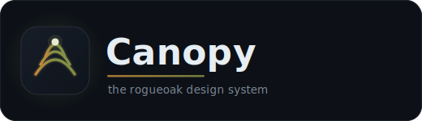

<p align="center">
  
</p>

<p align="center">
  <strong>An earthy, tree-themed design system for <a href="https://github.com/rogueoak">rogueoak</a> — built on Radix · shadcn · Tailwind v4 · TypeScript.</strong>
</p>

<p align="center">
  <a href="https://github.com/rogueoak/canopy/actions/workflows/ci.yml"></a>
  <a href="https://rogueoak.github.io/canopy/"></a>
  <a href="LICENSE"></a>
</p>

<p align="center">
  
  
  
  
</p>

---

> [!NOTE]
> **🚧 Status: early development.** Canopy is being built in the open, foundation-first.
> Nothing is published to npm yet, and the APIs below marked _(planned)_ don't exist
> yet — they describe where we're headed. Follow the [roadmap](#roadmap) for what's live.

## What is Canopy?

Canopy is the design system that defines the look, feel, and building blocks of **rogueoak**
— its products and its website. It ships as consumable **npm packages** so any rogueoak app
can build interfaces from the same earthy, considered foundation.

The whole system is organised like a tree, foundation → composite, and every layer is named
for a part of one. **rogueoak** is the forest, **canopy** is the system, and the layers
below grow from shared roots.

## The Canopy model

Atomic design, renamed by tree anatomy:

| Atomic layer        | Canopy name  | What lives here                                                                                                        |
| ------------------- | ------------ | ---------------------------------------------------------------------------------------------------------------------- |
| Design tokens       | **Roots** 🌱 | primitive + semantic tokens — colour, type, spacing, radii, elevation, motion. Everything draws nourishment from here. |
| Atoms               | **Seeds**    | the smallest components — Button, Input, Label, Icon, Badge                                                            |
| Molecules           | **Twigs**    | small compositions — FormField, SearchBar, Card                                                                        |
| Organisms           | **Branches** | larger assemblies — NavBar, DataTable, Dialog                                                                          |
| Templates _(later)_ | **Boughs**   | page scaffolds and layout patterns                                                                                     |
| The whole system    | **Canopy**   | the published library + the Storybook showcase                                                                         |

**Components only ever consume Roots semantic tokens** (`color-surface`, `text-primary`,
`radius-control`) — never raw palette values. Light and dark are a property of the token
layer: semantic tokens remap per theme, so a component is themed without knowing it.

## Tokens & theming

Roots is a **token source of truth**, not hand-written CSS. Tokens are authored once as
[DTCG](https://design-tokens.github.io/community-group/format/) JSON and compiled — via
[Style Dictionary](https://styledictionary.com) — into the outputs each consumer needs:

- **CSS custom properties** (`tokens.css`) for runtime theming
- **A typed TypeScript export** (`tokens`) for programmatic access
- **A Tailwind v4 `@theme` preset** (`tailwind-preset.css`) so utilities map straight onto tokens

The system is **two-tier**, so theming is a remap of one layer and never touches components:

- **Primitive ramps** — the raw palette, `50…950`: `moss` (brand), `bark`, `stone` (neutrals),
  `amber` (accent), and desaturated functional ramps `success` / `warning` / `danger` / `info`.
  Muted & natural; moss/olive brand. Primitives are **never used by components directly**.
- **Semantic tokens** — theme roles that **reference** primitives: surfaces
  (`color-bg`, `color-surface`, `color-muted`), text (`color-text`, `color-text-muted`,
  `color-text-subtle`), lines (`color-border`, `color-ring`), roles (`color-primary` +
  `-foreground`, `secondary`, `accent`), interaction states (`-hover`/`-active`, plus a
  `color-disabled` + `-foreground` convention) and status (`success`/`warning`/`danger`/`info`).
  Components consume **only** these. Each role has a **light and a dark value** — see Theming.

Alongside colour: **typography** (Figtree sans + Geist Mono, type scale `text-xs…6xl`, weights,
leading, tracking), **spacing** (4px base), **radii**, **elevation** (`shadow-*`), and **motion**
(durations + easings). Token names flatten onto Tailwind v4 `@theme` namespaces so utilities
generate directly: `color-*`→`bg-*`/`text-*`, `radius-md`→`rounded-md`, `text-lg`→`text-lg`,
`font-sans`→`font-sans`, `shadow-md`→`shadow-md`, and spacing utilities (`p-4`, `gap-2`) derive
from a single `--spacing` base.

**Fonts are self-hosted** (no CDN). Roots ships the family _names_; consumers install the
open-licensed [`@fontsource`](https://fontsource.org) packages and import them once:

```bash
pnpm add @fontsource-variable/figtree @fontsource-variable/geist-mono
```

```css
/* in your global stylesheet, alongside the Roots imports */
@import '@fontsource-variable/figtree';
@import '@fontsource-variable/geist-mono';
@import '@rogueoak/roots/tokens.css';
@import '@rogueoak/roots/tailwind-preset.css';
```

This pipeline is deliberately built to grow: a **native (Swift) target** can be added later
as just another output platform, without rewriting a single token. _(native target: planned)_

### Theming (light & dark)

The theme is a property of the **token layer**, not your components. `tokens.css` declares the
light theme on `:root` and a **`.dark`** block that re-points only the **semantic** vars at
different primitive ramp steps (primitives are the shared, theme-agnostic palette and are not
repeated). Because every utility (`bg-primary`, `text-default`, …) and `var(--color-*)` read
resolves through those runtime vars, toggling a single class **re-themes the whole UI with zero
per-component code**. Light is the default; add `dark` to a root element to flip:

```ts
// the one-line mechanism — toggle the class on <html> (or any container)
document.documentElement.classList.toggle('dark');
```

Optional — respect the OS preference on first paint (before your app hydrates):

```html
<script>
  // bootstrap: honour a saved choice, else the OS setting
  const saved = localStorage.getItem('theme');
  const dark = saved ? saved === 'dark' : matchMedia('(prefers-color-scheme: dark)').matches;
  document.documentElement.classList.toggle('dark', dark);
</script>
```

The common path needs **no `dark:` utilities** — semantic tokens auto-flip. For the rare
explicit case, add Tailwind's dark variant once in your global CSS so `dark:` utilities work:

```css
@custom-variant dark (&:where(.dark, .dark *));
```

Every semantic role meets **WCAG AA in both themes** — a build-time test computes the real
contrast ratios for light _and_ dark and fails the build on any regression. Interaction-state
roles (`color-primary-hover`/`-active`, `secondary`, `accent`, `danger-hover`) and a
`color-disabled` surface + `color-disabled-foreground` convention are defined with light and
dark values too, ready for the first components.

## Distribution

Canopy publishes under the **`@rogueoak`** npm scope as a small set of versioned packages:

| Package            | Holds                                        | Status      |
| ------------------ | -------------------------------------------- | ----------- |
| `@rogueoak/roots`  | design tokens + Tailwind preset              | _(planned)_ |
| `@rogueoak/canopy` | components (`/seeds`, `/twigs`, `/branches`) | _(planned)_ |

## Quick start

> _(planned — available once the first packages publish)_

```bash
pnpm add @rogueoak/canopy @rogueoak/roots
```

```tsx
import { Button } from '@rogueoak/canopy/seeds';

export function Example() {
  return <Button>Plant a seed</Button>;
}
```

### Wiring the styles (the Tailwind-source seam)

Canopy ships **`className` strings** (Tailwind v4 utilities), not a prebuilt stylesheet —
so your build generates and tree-shakes only the utilities you actually use, and your
`.dark` flips canopy too. You wire this once in your global CSS: import Tailwind and the
Roots preset, then add `@source` pointing at `@rogueoak/canopy` so Tailwind scans canopy's
component source and emits its utilities into _your_ build:

```css
@import 'tailwindcss';
@import '@rogueoak/roots/tailwind-preset.css';

/* Generate canopy's component utilities by scanning its shipped code. Without this,
   canopy components render UNSTYLED — the utilities never get emitted. `@source` takes a
   PATH (Tailwind v4 has no bare-package resolution), RELATIVE TO THIS CSS FILE — adjust the
   `../` depth so it resolves to canopy in your node_modules. */
@source '../node_modules/@rogueoak/canopy';
```

(Add the `@rogueoak/roots/tokens.css` and `@fontsource` imports too — see
[Tokens & theming](#tokens--theming).) This is exactly how the Storybook app — Canopy's
first consumer — is wired (it points `@source` at canopy's source by relative path). A
prebuilt-CSS bundle for non-Tailwind consumers may come later.

## Storybook

The component showcase — swatches, type specimens, and every component in light and dark —
lives on **GitHub Pages**, built from Storybook and deployed by CI on every push to `main`:
**https://rogueoak.github.io/canopy/**. The **Foundations** section is the living spec —
colour ramps + semantic swatches, the Figtree type specimen and scale, spacing, radii,
elevation, motion, a WCAG AA contrast table, and a **Theme** demo. Use the toolbar
**Light / Dark** toggle — every story reads correctly in both themes (it flips `.dark`).

## Development

Canopy is a **pnpm + Turborepo** monorepo. Requires Node 20+ and pnpm 11+
(`npm install -g pnpm`). The workflow:

```bash
pnpm install      # install the workspace
pnpm build        # build tokens (Style Dictionary), components (tsup), and Storybook
pnpm storybook    # run the showcase locally at http://localhost:6006
pnpm test         # run the test suite (Vitest)
pnpm lint         # lint the workspace (ESLint + Prettier)
pnpm changeset    # record a version bump for release
```

Layout:

| Path              | Package            | What it is                                                                       |
| ----------------- | ------------------ | -------------------------------------------------------------------------------- |
| `packages/roots`  | `@rogueoak/roots`  | design tokens → CSS vars, typed TS export, Tailwind v4 preset (Style Dictionary) |
| `packages/canopy` | `@rogueoak/canopy` | components, built to ESM + types (tsup)                                          |
| `apps/storybook`  | _private_          | the Storybook showcase, deployed to GitHub Pages                                 |

> Roots ships the **real foundation** plus **light & dark theming**: primitive ramps + semantic
> tokens (light + dark, with interaction states), type, spacing, radii, elevation, and motion.
> The full **Seeds** atom catalogue is live, built on the shared component **recipe** (`cn()`, cva
> variants over semantic tokens, Radix `Slot` for `asChild`). The first **Twigs** (molecules) are
> live too — **FormField**, **SearchBar**, and **Card** — composing those atoms on the
> `@rogueoak/canopy/twigs` subpath.

## Roadmap

Built foundation-first, so there's **always working software and working docs** at each step:

- [x] **Roots** — tokens: palette, typography, spacing, radii, elevation, motion; light & dark theming
- [x] **Seeds** — the atoms; the full first catalogue is live
- [x] **Twigs** — molecules; the first compositions are live (FormField · SearchBar · Card)
- [ ] **Branches** — organisms (NavBar, Dialog, DataTable)
- [ ] **Boughs** — page scaffolds and layout patterns

Development follows the [Spectra protocol](docs/spectra/protocol.md): every change is built and
tested before merge, and **this README is updated as the system grows** so the docs never
outrun the software.

## License

[MIT](LICENSE) © rogueoak
